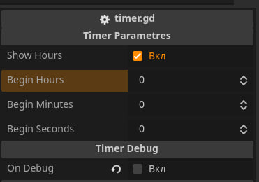

# Simple Timer for Godot Engine

## Timer parametres

## Timer methods:

| Methods         | Parametre        | Return            |
| :------------   |:---------------  |:-----             |
| setDataTimer()  | new_data : Array | void              |
| clearDataTimer()| null             | void              |
| getDataTimer()  | null             | data : Dictionary |

# Installing Simple Timer
1. Download resource
2. Drag and drop resource to your project
3. Adding timer.tscn in your interface
